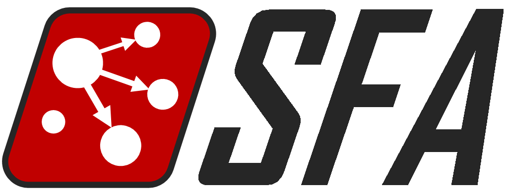

Signal Flow Analysis (SFA)
==========================

A simulation framework to analyze signal flows in complex networks.

## Features ##
* Estimate the signal flow using only the network topology.
* Calculate the influence using only the network topology.
* Suggest the control target candidates using only the network topology.
* Apply multiple algorithms to multiple datasets.
* Perform large-scale simulations with parallel processing.
* Support user-defined algorithms and datasets.

## Python version ##
* Both Python 2 and 3 are supported.
* Some features such as parallel processing are supported only in the specific versions of Python.

## Documentation ##
http://sfa.readthedocs.io

## References ##
* Daewon Lee & Kwang-Hyun Cho  
  "Topological estimation of signal flow in complex signaling networks"  
  [*Scientific Reports* (2018) **8**:5262](https://www.nature.com/articles/s41598-018-23643-5)  

* Daewon Lee & Kwang-Hyun Cho  
  "Signal flow control of complex signaling networks"  
  [*Scientific Reports* (2019) **9**:14289](https://www.nature.com/articles/s41598-019-50790-0)  

## Any question or comment ##
If you have any question or comment, please use `Issues` tab in this repository.
